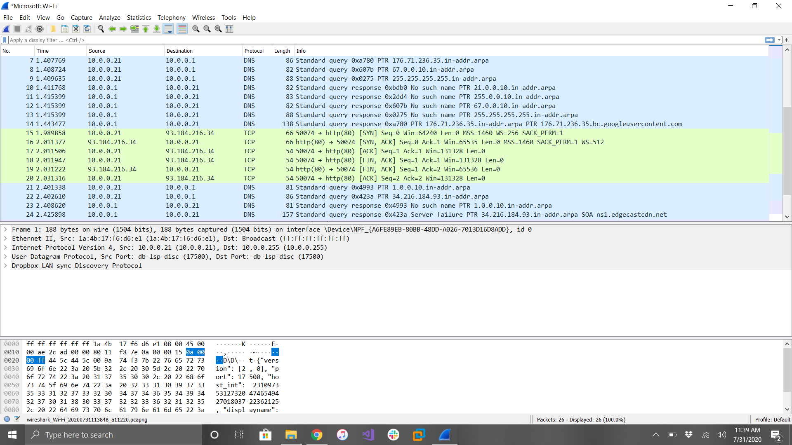

__Tutorial Objectives:__
1. WireShark Install/Setup
2. Capture data packets
3. Analyze the captured packets
4. Capture Filters

---

1. To install WireShark, you must go to their website and find the download for your specific OS. If you're on Windows, then you will want to select 'Windows Installer 64 bit'. [WireShark -Download](https://www.wireshark.org/download.html).  Once you have downloaded the Installer, the setup window will appear. Click 'Next' until the application starts to install.  Once the install is complete, you will be asked to restart your system.

2. Now that WireShark is installed and ready to go, let's do our first packet capture.  Open WireShark and on the home page there will be a list of the network connections that you can see.   Select the network you would like to trace, then right click to view the 'Start Capture' option. Click that to start your first capture of packets.  Once you have captured as many packets as you want, click the red square in the top left corner to stop the trace. .

3. Now that we have captured our first packet trace, it is time to analyze the packets and data. (Make sure the capture is stopped before analyzing the packets).  WireShark provides three viewing windows containing the packets and their data. The top pane is a list of all the packets that were captured in the trace. You can click on a packet in the top window to view its details below in the other two windows.  The middle window shows all types of information about the selected packet above, such as: the time it took to travel, the source of the packet, where the packet is headed to, the protocol for the packet (TCP, DNS, ARP, etc.), and the length of the packet in bytes.   . The bottom window is used to view the packed as it was captured in hexadecimal formatting.

4. The last thing we will go over in this tutorial will be the Capture Filters on Wireshark. These filters help view the capture in multiple ways to help troubleshooting. The filters will limit the amount of traffic captured on the traces.  To use a capture filter, click 'File' then either 'Save and Close' the old capture or just close it to return back to the home page.  Now, above where you select the network that you want to capture, there will be a 'Capture Filters' dropdown. For our example, let's use the 'IP' filter since it is fairly simply.  This filter will only show IPv4 traffic on the network. Start the capture like normal and when you look at the packets that were captured, it should only be IPv4 traffic. .

[README](https://github.com/smf5w4/IT1600)
